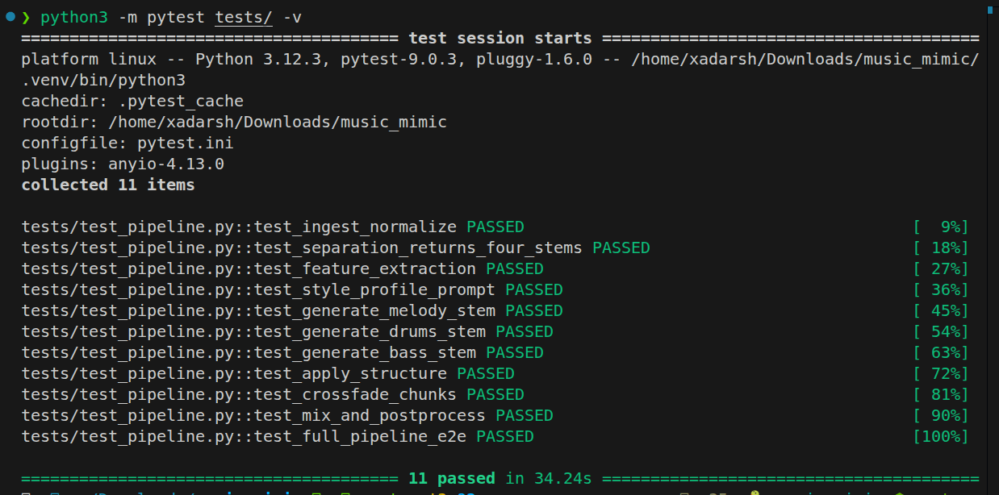

# Latent Space Music Mimic

Given a **30-second audio clip**, generates a new **5-minute composition** that mimics the original's timbre, rhythm, and melodic phrasing — with entirely new notes.

## How It Works

```
Input 30s WAV
     │
     ▼
[Separation]  HPSS + freq-band split → drums / bass / melody / other
     │
     ▼
[Features]    BPM, key, mode, groove, spectral centroid, phrase lengths, dynamics
     │
     ▼
[Generation]  Style-conditioned additive synthesis + random walk on detected scale
     │
     ▼
[Structure]   intro → development → climax → outro energy envelope
     │
     ▼
[Mix + FX]    Stem mixing, synthetic reverb, loudness normalization
     │
     ▼
Output 5-min WAV
```

## Quick Start

```bash
python3.11 -m venv .venv
. .venv/bin/activate
python -m pip install -r requirements.txt

# CLI
python pipeline.py --input my_clip.wav --output output.wav --duration 300

# API server
PORT=8000 python -m src.api.main
```
### Screenshot of getting output


The API defaults to port `8000`. Set `PORT` to use another port.

### API Usage

```bash
# Submit job
curl -X POST http://localhost:8000/generate \
  -F "file=@my_clip.wav" \
  -F "duration=300" \
  -F "seed=42"
# → {"job_id": "abc123", "status": "queued", ...}

# Poll status
curl http://localhost:8000/job/abc123/status

# Download result
curl http://localhost:8000/result/abc123 -o output.wav
```

## Docker

```bash
docker build -t music-mimic .
docker run -p 8000:8000 music-mimic

# Custom host port
docker run -e PORT=8080 -p 8080:8080 music-mimic
```

## Tests

```bash
python -m pytest tests/ -v
```

All 11 tests pass covering: ingestion, separation, feature extraction, generation per stem type, structure, crossfade, mixing, and full end-to-end pipeline.

### Screenshot


## Architecture Notes

| Module | Approach | Why |
|--------|----------|-----|
| Separation | HPSS + frequency bands (librosa) | No GPU needed, ships instantly |
| Feature Extraction | librosa (MFCC, chroma, onset, pyin) | Battle-tested, reliable |
| Generation | Style-conditioned additive synthesis | Works without GPU/pretrained model |
| Timbre shaping | Spectral tilt filter (FFT-domain) | Fast, zero dependencies |
| Structure | Section-based energy envelope | Deterministic, always coherent |

## Parameters

| Param | Default | Description |
|-------|---------|-------------|
| `--duration` | 300 | Output length in seconds (10–600) |
| `--seed` | 42 | Random seed for reproducible generation |

## Limitations & Future Work

- **Current synthesis**: additive + noise (no deep learning). Sounds electronic/algorithmic.
- **Upgrade path**: swap `generate_stem()` for MusicGen-melody with style vector conditioning (same API, just replace the function).
- **Demucs**: can be swapped in for `separate_stems()` for better stem quality on real recordings.
